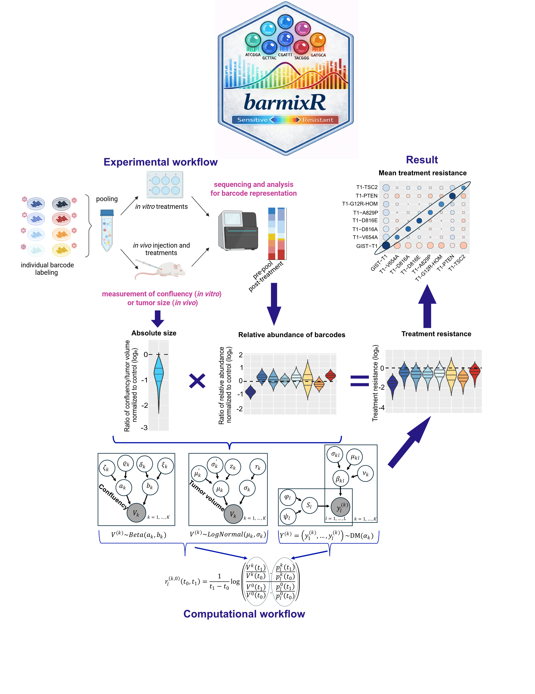

# R package: barmixR

**Bayesian Modeling of Barcoded Tumor Mixtures for Quantitative Treatment Resistance Analysis**

barmixR implements a Bayesian framework for analyzing treatment responses in pooled cancer cell populations labeled with genetic barcodes. The method integrates **barcode sequencing counts** with **population size measurements** to estimate clone-specific **quantitative treatment resistance (QTR)** while accounting for uncertainty in both sequencing and population size measurements through a unified Bayesian model.

## Experimental and computational workflow

<p align="center">

</p>

In multiplexed lineage-tracing experiments, individual cell lines are labeled with unique DNA barcodes and pooled together. The pooled population is exposed to treatments either *in vitro* or *in vivo*. Barcode sequencing quantifies the **relative abundance of each clone**, while measurements of **confluency (in vitro)** or **tumor volume (in vivo)** quantify **population size dynamics**.

barmixR jointly models these data sources in a Bayesian hierarchical framework. Barcode sequencing counts are modeled using a **Dirichlet–multinomial distribution** to account for compositional sequencing data, whereas population size measurements are modeled using:

- a **log-normal likelihood** for tumor volume (*in vivo*)
- a **beta likelihood** for confluency (*in vitro*)

Posterior inference is performed using **Hamiltonian Monte Carlo** implemented in the `rstan` package, enabling full uncertainty propagation from barcode composition and population size measurements to quantitative treatment resistance estimates.

Population size corresponds to:

- **tumor volume in *in vivo* experiments**
- **cellular confluency in *in vitro* assays**

---

# System requirements

barmixR uses **Stan models**, which require a C++ toolchain.

## Windows

Install **Rtools**:

https://cran.r-project.org/bin/windows/Rtools/

Restart R after installation.

## macOS

```bash
xcode-select --install
```

## Linux

```bash
sudo apt install build-essential
```

---

# Installation

Install the development version from GitHub:

```r
if (!requireNamespace("remotes", quietly = TRUE))
  install.packages("remotes")

remotes::install_github("MohammadDarbalaei/barmixR")
```

---

## Dependencies

barmixR relies on the following R packages:

- rstan  
- ggplot2  
- dplyr  
- bayesplot  
- loo  
- patchwork  
- viridis  
- BiocParallel  

Install required dependencies with:

```r
install.packages(c(
  "rstan",
  "ggplot2",
  "dplyr",
  "bayesplot",
  "loo",
  "patchwork",
  "viridis"
))

if (!requireNamespace("BiocManager", quietly = TRUE))
  install.packages("BiocManager")

BiocManager::install("BiocParallel")
```

---

## Usage

Fit the barmixR model using barcode count data together with population size measurements.

```r
library(barmixR)

fit <- barmixRQTR(
  data = data,
  time_d = time_d,
  control = list(
    chains = 2,
    iter_count = 10000,
    iter_V = 10000,
    cores = 2
  )
)
```

---

## Analysis workflow

A typical barmixR analysis consists of the following steps:

1. Fit the Bayesian model  
2. Perform posterior predictive checks for barcode composition  
3. Estimate ratios of relative barcode abundance  
4. Perform posterior predictive checks for population size  
5. Estimate ratios of population size 
6. Estimate quantitative treatment resistance  
7. Visualize resistance landscapes  
8. Rank treatments 

```r
model <- fit

# Posterior predictive checks for barcode composition
ppc_barcode <- ppcBarcodes(model)
sampled_fraction <- ppc_barcode$sampled_fraction

# Relative barcode abundance ratios
ratio_fraction <- fractionRatio(model, sampled_fraction)

# Posterior predictive checks for population size
ppc_population <- ppcPopulation(model)
sampled_population <- ppc_population$sampled_population

# Population size ratios
ratio_population <- populationRatio(model, sampled_population)

# Estimate quantitative treatment resistance
resistance <- QTRresistance(
  model,
  ratio_fraction$li_sam_ratio_relative,
  ratio_population$li_sam_ratio_V
)

# Visualize treatment resistance landscape
heatmap <- QTRheatmap(
  model,
  resistance$summary_table
)

# Treatment ranking and decision support
decision <- QTRDecision(
  model = model,
  summary_table = resistance$summary_table
)
```

---

## License

GPL-3
